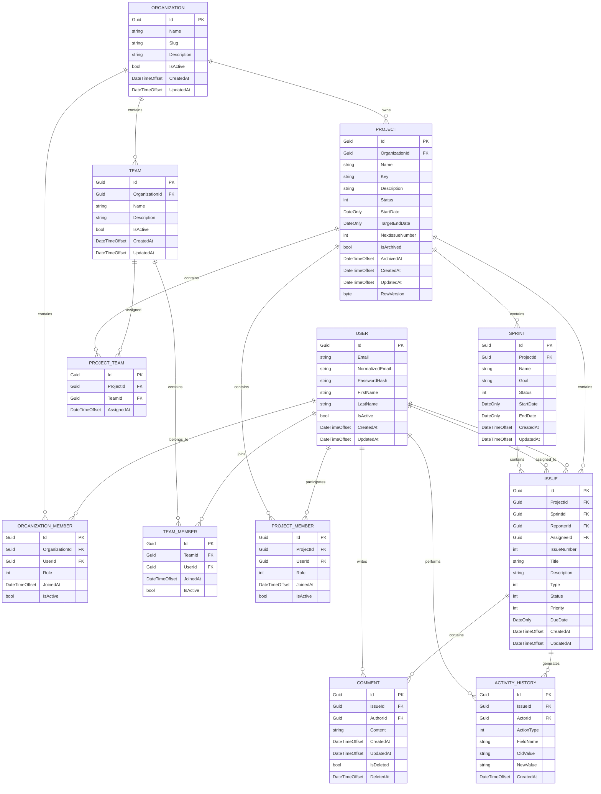

# DevFlow — Entity Relationship Diagram

## 1. Overview

This document contains the initial Entity Relationship Diagram for the DevFlow database.

The diagram uses Mermaid syntax and can be rendered by GitHub and compatible Markdown tools.

---

# 2. Entity Relationship Diagram



---

# 3. Core Ownership Hierarchy

```text
Organization
│
├── OrganizationMember
│
├── Team
│   └── TeamMember
│
└── Project
    │
    ├── ProjectMember
    │
    ├── ProjectTeam
    │
    ├── Sprint
    │   └── Issue
    │
    └── Issue
        ├── Comment
        └── ActivityHistory
```

---

# 4. Many-to-Many Relationships

DevFlow contains the following many-to-many relationships:

```text
User <-> Organization

implemented through:

OrganizationMember
```

```text
User <-> Team

implemented through:

TeamMember
```

```text
User <-> Project

implemented through:

ProjectMember
```

```text
Team <-> Project

implemented through:

ProjectTeam
```

Explicit join entities are used to support metadata, authorization, auditing, and future extensibility.

---

# 5. Important Schema Rules

The following rules must be maintained:

* OrganizationMember User and Organization combination must be unique.
* TeamMember User and Team combination must be unique.
* ProjectMember User and Project combination must be unique.
* ProjectTeam Team and Project combination must be unique.
* Project Key must be unique within an Organization.
* Issue Number must be unique within a Project.
* Team members must belong to the Team's Organization.
* Project members must belong to the Project's Organization.
* Assigned Teams and Projects must belong to the same Organization.
* Sprint and Issue must belong to the same Project.
* Issue Assignees must have Project access.
* Organizations must retain at least one Owner.
